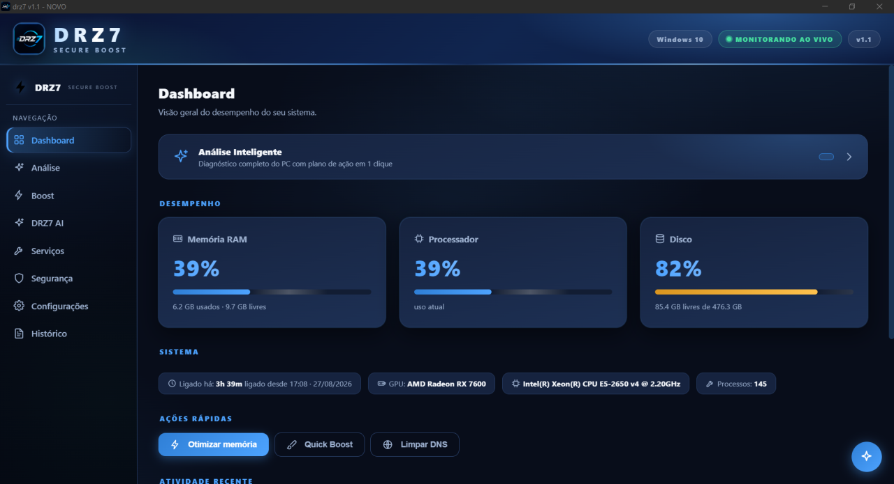
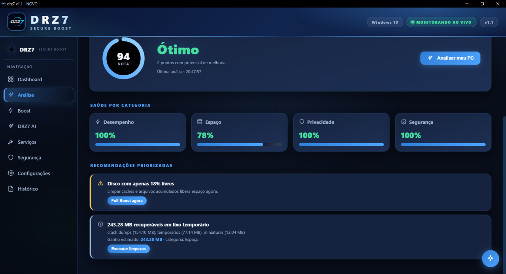
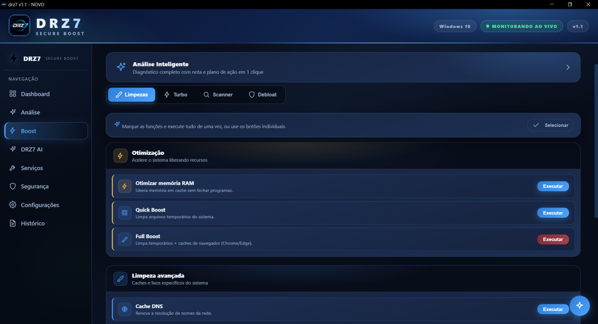
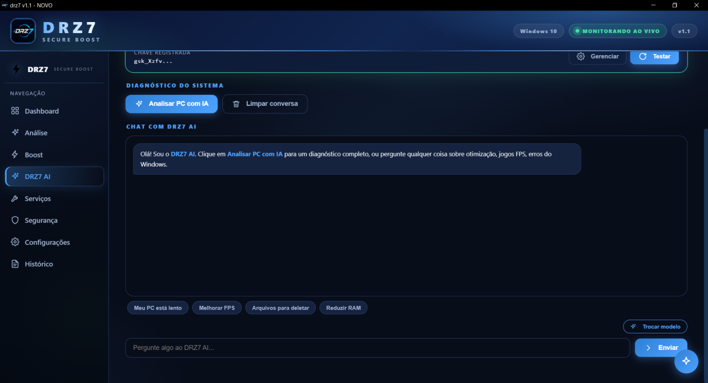

# 🚀 DRZ7 Optimizer Atualizador

<div align="center">
  
</div>

<div align="center">
  
**Hub oficial de versões, atualização e manutenção do DRZ7 Optimizer** 

[Versão](#versão) • [Features](#features) • [Download](#-download-premium) • [Screenshots](#galeria-de-screenshots) • [Documentação](#documentação) • [Licença](#licença)

</div>

---

## 📥 Download Premium

<p align="center">
  <a href="https://github.com/MateusDrz7/otimizador-atualizador/releases/latest">
    
  </a>
</p>

<p align="center">
  <a href="https://github.com/MateusDrz7/otimizador-atualizador/releases">
    
  </a>
</p>

---

## 📋 Visão Geral

O **DRZ7 Optimizer Atualizador** é o centro oficial de distribuição do projeto, centralizado em um só lugar:

- 📦 **Versões oficiais** em releases organizadas
- 🔄 **Controle de atualização** simples e seguro
- 📖 **Documentação completa** para instalação e uso
- 🎨 **Visual profissional** alinhado ao produto
- 🚀 **Base sólida** para crescimento contínuo

---

## ✨ Features

<table align="center">
  <tr>
    <td align="center">
      <strong>⚡ Rápido</strong><br/>
      Download e<br/>atualização instantânea
    </td>
    <td align="center">
      <strong>🔒 Seguro</strong><br/>
      Releases verificadas<br/>e confiáveis
    </td>
    <td align="center">
      <strong>📱 Moderno</strong><br/>
      Interface limpa e<br/>profissional
    </td>
  </tr>
  <tr>
    <td align="center">
      <strong>📊 Organizado</strong><br/>
      Changelog completo<br/>e estrutura clara
    </td>
    <td align="center">
      <strong>🌐 Acessível</strong><br/>
      Documentação em<br/>português
    </td>
    <td align="center">
      <strong>🎯 Intuitivo</strong><br/>
      Fluxo simples de<br/>uso
    </td>
  </tr>
</table>

---

## 🖼️ Galeria de Screenshots

<div align="center">
  <h3>🎮 Dashboard Principal</h3>
  
  
  ---
  
  <h3>📊 Análise Inteligente</h3>
  
  
  ---
  
  <h3>⚡ Boost e Otimização</h3>
  
  
  ---
  
  <h3>🤖 Assistente DRZ7 AI</h3>
  
</div>

---

## 🎨 Interface Inspirada no Produto

A identidade visual do projeto reflete a estética moderna do DRZ7 Optimizer, com destaque para:

- **Paleta de cores**: Azul escuro, ciano e verde
- **Estilo**: Blocos de métricas e painéis responsivos
- **Experiência**: Interface limpa e intuitiva

```
┌────────────────────────────────────────────────────────────┐
│                                                            │
│  🔷 DRZ7              SECURE BOOST              v1.1      │
│                                                            │
├────────────────────────────────────────────────────────────┤
│                                                            │
│  Dashboard │ Análise │ Boost │ DRZ7 AI                    │
│                                                            │
│  ┌─────────────────┬─────────────────┬─────────────────┐  │
│  │ RAM 39%         │ CPU 39%         │ DISCO 82%       │  │
│  │ 6.2 GB / 9.7 GB │ Uso atual       │ 85.4 GB / 476 GB│  │
│  └─────────────────┴─────────────────┴─────────────────┘  │
│                                                            │
│  [ 🚀 Otimizar ] [ ⚙️ Boost ] [ 🌐 Limpar DNS ]          │
│                                                            │
└────────────────────────────────────────────────────────────┘
```

---

## 📥 Como Usar

### 1️⃣ **Baixar**
Clique no botão acima para acessar a última versão disponível.

### 2️⃣ **Instalar**
Extraia ou execute o instalador conforme o arquivo baixado.

### 3️⃣ **Usar**
Abra o aplicativo e aproveite todas as funcionalidades.

### 4️⃣ **Atualizar**
Consulte este repositório regularmente para novas versões.

---

## 📁 Estrutura do Repositório

```
otimizador-atualizador/
│
├── 📄 README.md                 # Este arquivo
├── 📝 CHANGELOG.md              # Histórico de versões
├── 📜 LICENSE                   # Licença MIT
├── ⚙️  version.json             # Versão atual
├── 🤝 CONTRIBUTING.md           # Guia de contribuição
│
├── 📚 docs/                     # Documentação
│   ├── README.md               # Índice da documentação
│   ├── instalacao.md           # Guia de instalação
│   └── uso.md                  # Guia de uso
│
├── 🖼️  assets/                  # Imagens do projeto
│   ├── README.md               # Instruções dos assets
│   ├── dashboard.png           # Tela do dashboard
│   ├── analise.png             # Tela de análise
│   ├── boost.png               # Tela de boost
│   └── ai.png                  # Tela da IA
│
└── releases/                    # Pacotes de release
```

---

## 📊 Versão

A versão atual do projeto está registrada em [version.json](version.json)

- [🔗 GitHub Releases](https://github.com/MateusDrz7/otimizador-atualizador/releases)
- [📌 Última Release](https://github.com/MateusDrz7/otimizador-atualizador/releases/latest)

---

## 📖 Documentação

| Documento | Descrição |
|-----------|-----------|
| [📚 Principal](docs/README.md) | Índice e visão geral da documentação |
| [💾 Instalação](docs/instalacao.md) | Passo a passo para instalar |
| [🎯 Uso](docs/uso.md) | Como usar e atualizar o software |
| [📋 Changelog](CHANGELOG.md) | Histórico completo de versões |
| [🤝 Contribuir](CONTRIBUTING.md) | Como contribuir ao projeto |

---

## 🔄 Changelog

### [1.1.0] - 2026-10-05

**✨ Adicionado**
- Documentação principal do projeto
- README profissional e visualmente modernizado
- Guia de instalação completo
- Guia de uso e atualização
- Organização pronta para releases

**🔧 Ajustado**
- Apresentação visual alinhada ao estilo DRZ7 Optimizer
- Estrutura de navegação melhorada
- Branding mais profissional

---

## 🎯 Status do Projeto

<div align="center">
  
  
  
  
</div>

---

## 👨‍💻 Autor

<div align="center">
  
**Mateus DRZ7**

🔗 [GitHub](https://github.com/MateusDrz7) • 📦 [Repositório](https://github.com/MateusDrz7/otimizador-atualizador)

</div>

---

## 📜 Licença

Este projeto está licenciado sob a **MIT License** - você é livre para usar, modificar e distribuir.

Consulte o arquivo [LICENSE](LICENSE) para detalhes completos.

---

<div align="center">


**⭐ Se gostou, deixe uma estrela! ⭐**

</div>
